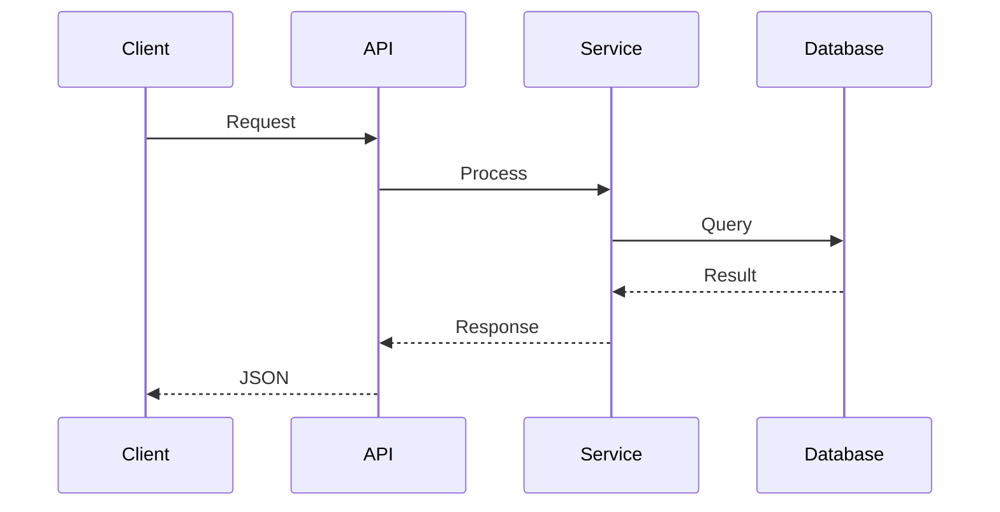

# {{PROJECT_NAME}}

{{PROJECT_DESCRIPTION}}

## Overview

This microservice is built using modern development practices and includes:

- 🚀 Fast and efficient service architecture
- 🔒 Security best practices
- 📊 Comprehensive monitoring and logging
- 🧪 Extensive testing suite
- 🐳 Docker containerization
- 📖 API documentation

## Quick Start

### Prerequisites

- Docker and Docker Compose
- Node.js 18+ (for development)
- Git

### Installation

```bash
# Clone the repository
git clone https://github.com/{{GITHUB_OWNER}}/{{PROJECT_NAME}}.git
cd {{PROJECT_NAME}}

# Install dependencies
npm install

# Copy environment variables
cp .env.example .env

# Start the service
npm run dev
```

### Docker Quick Start

```bash
# Build and run with Docker Compose
docker-compose up --build
```

## API Documentation

The API documentation is available at:
- **Development**: http://localhost:{{PORT}}/docs
- **Production**: {{PRODUCTION_URL}}/docs

## Project Structure

```
{{PROJECT_NAME}}/
├── src/                    # Source code
│   ├── controllers/        # Request handlers
│   ├── services/          # Business logic
│   ├── models/            # Data models
│   ├── middleware/        # Express middleware
│   ├── routes/            # API routes
│   └── utils/             # Utility functions
├── tests/                 # Test suites
│   ├── unit/              # Unit tests
│   ├── integration/       # Integration tests
│   └── fixtures/          # Test data
├── docs/                  # Documentation
├── scripts/               # Build and deployment scripts
├── .github/               # GitHub workflows and templates
├── docker-compose.yml     # Local development setup
├── Dockerfile            # Container definition
└── package.json          # Dependencies and scripts
```

## Development

### Available Scripts

- `npm run dev` - Start development server with hot reload
- `npm run build` - Build production bundle
- `npm run test` - Run test suite
- `npm run test:watch` - Run tests in watch mode
- `npm run test:coverage` - Generate test coverage report
- `npm run lint` - Run ESLint
- `npm run lint:fix` - Fix ESLint issues
- `npm run format` - Format code with Prettier

### Environment Variables

| Variable | Description | Default |
|----------|-------------|---------|
| `PORT` | Server port | 3000 |
| `NODE_ENV` | Environment | development |
| `DATABASE_URL` | Database connection string | - |
| `JWT_SECRET` | JWT signing secret | - |
| `LOG_LEVEL` | Logging level | info |

## Testing

```bash
# Run all tests
npm test

# Run tests with coverage
npm run test:coverage

# Run specific test file
npm test -- tests/unit/service.test.js

# Run tests in watch mode
npm run test:watch
```

## Deployment

### Production Build

```bash
# Build for production
npm run build

# Start production server
npm start
```

### Docker Deployment

```bash
# Build production image
docker build -t {{PROJECT_NAME}}:latest .

# Run container
docker run -p {{PORT}}:{{PORT}} --env-file .env {{PROJECT_NAME}}:latest
```

### Environment Deployment

The service is automatically deployed to:

- **Staging**: Deployed on every merge to `develop`
- **Production**: Deployed on every release tag

## Monitoring and Logging

- **Health Check**: `GET /health`
- **Metrics**: `GET /metrics` (Prometheus format)
- **Logs**: Structured JSON logging with correlation IDs

## Security

- JWT-based authentication
- Input validation and sanitization
- Rate limiting
- CORS configuration
- Security headers
- Vulnerability scanning

## Contributing

1. Fork the repository
2. Create a feature branch (`git checkout -b feature/amazing-feature`)
3. Commit your changes (`git commit -m 'Add amazing feature'`)
4. Push to the branch (`git push origin feature/amazing-feature`)
5. Open a Pull Request

### Development Guidelines

- Follow the existing code style
- Write tests for new features
- Update documentation
- Ensure all tests pass
- Keep commits atomic and well-described

## Architecture

### Service Architecture

```mermaid
graph TB
    A[Client] --> B[Load Balancer]
    B --> C[API Gateway]
    C --> D[{{PROJECT_NAME}} Service]
    D --> E[Database]
    D --> F[Cache]
    D --> G[External APIs]
```

### Data Flow



## License

This project is licensed under the MIT License - see the [LICENSE](LICENSE) file for details.

## Support

- 📧 Email: {{SUPPORT_EMAIL}}
- 💬 Slack: #{{PROJECT_NAME}}
- 📖 Wiki: [Project Wiki]({{WIKI_URL}})
- 🐛 Issues: [GitHub Issues]({{GITHUB_URL}}/issues)

## Changelog

See [CHANGELOG.md](CHANGELOG.md) for a list of changes and version history.